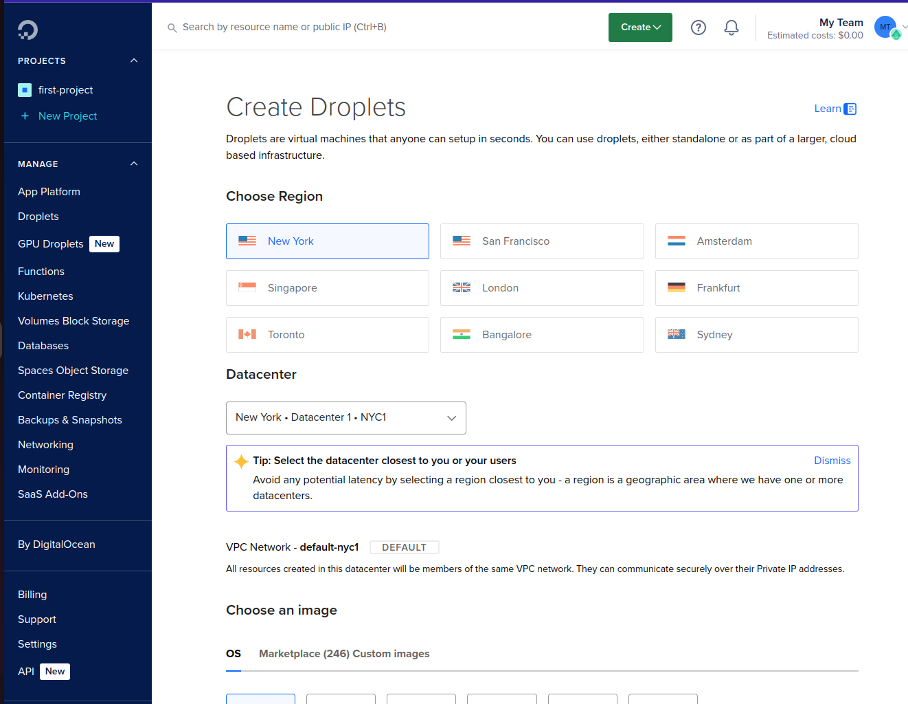

# Server-Deploy-DO 

We will create a server and deploy an application on DigitalOcean, showing the process step by step.

## Overview
We will deploy an application on a cloud server:
- Create a virtual server on a cloud provider.
- Deploy an app on the server and configure access.
- Common concepts and best practices.

---

## SetUp Servers on DigitalOcean

### Prerequisites:
- Create a [DigitalOcean account](https://www.digitalocean.com/) (FREE TIER).

### Steps:
1. **Log In to DigitalOcean.**
2. **Create a Droplet:**
   - Choose a region near to us.
   - 
   - Select the operating system (OS) for the VM.
   - Choose the size that your server will have (we don't need additional storage and backups for now).
3. **Connect to the VM via SSH.**
   - We create the Droplet and connect using SSH for better security.
4. **Configure SSH Keys:**
   - Go to **Settings** -> **Security** to add your SSH Key for secure connections.
5. **Enter the server:**
   - By default, the server is not protected, and all ports are open (bad security practice).
6. **Create Firewall Rules:**
   - In **Networking**, configure the firewall:
     - Create a firewall for all of DigitalOcean, and add rules to allow only necessary ports (like port 22 for SSH).
   - Add the public IP of the server, along with the port.
7. **Test access:**
   - Now, the server has a **Public IP Address** and SSH port (22) open.
   - You can now connect to your server using SSH:
     ```bash
     ssh root@YOUR-IP-ADDRESS
     ```
8. **Install Required Software:**
   - Update the packages:
     ```bash
     apt update
     ```
   - Install Java:
     ```bash
     apt install openjdk-8-jre-headless
     ```
   - Similarly, install Docker, Node, etc.

---

## Deploy and Run Application Artifact on Droplet

### What are we going to do?
1. Build the JAR file.
2. Copy it to the remote server.
3. Run the app on the remote server.

### Steps:
1. **Clone the project:**
   - Clone a Java project and build a JAR file on our local machine:
     ```bash
     gradle build
     ```
2. **Copy the file to the server:**
   - Use `scp` (secure copy) to transfer the file to the remote server:
     ```bash
     scp <local-file> <destination>
     ```
3. **Run the app on the server:**
   - On the server, execute the JAR file:
     ```bash
     java -jar <name-of-Jar>
     ```
4. **Access the app from the browser:**
   - Configure the firewall to open the port (e.g., port 8080) and make the app publicly available.
   - Access the app by pasting the **IP Address** and port in your browser.
5. **Running in detached mode:**
   - To run the app without tying up the terminal:
     ```bash
     java -jar <name-of-Jar> &
     ```
   - This allows the terminal to be used for other commands.
6. **Check the process:**
   - Check if the app is running using:
     ```bash
     ps aux | grep java
     ```
   - To check the port usage:
     ```bash
     netstat -lnpt
     ```

---

## Create a Linux User

### Why create a separate Linux user?
- Best security practice: 
   - Create a separate user for every application.
   - Assign only the permissions the app needs.
   - Avoid using the root user for security reasons.

### Steps:
1. **Create a new user:**
   - Create a new user with:
     ```bash
     adduser <user_name>
     ```
   - Add the user to the sudo group to escalate permissions:
     ```bash
     usermod -aG sudo <user_name>
     ```
2. **Switch to the new user:**
   - Switch users:
     ```bash
     su - <user_name>
     ```
   - Log out of the user with:
     ```bash
     exit
     ```
3. **Configure SSH access for the new user:**
   - To access the server with the new user, configure SSH public keys for this user (similar to how you did for root):
     - First, switch to the new user and create the `.ssh` folder.
     - Add the public key to:
       ```bash
       sudo vim .ssh/authorized_keys
       ```
   - After setting the key, access the server with:
     ```bash
     ssh <user_name>@IP-ADDRESS
     ```

